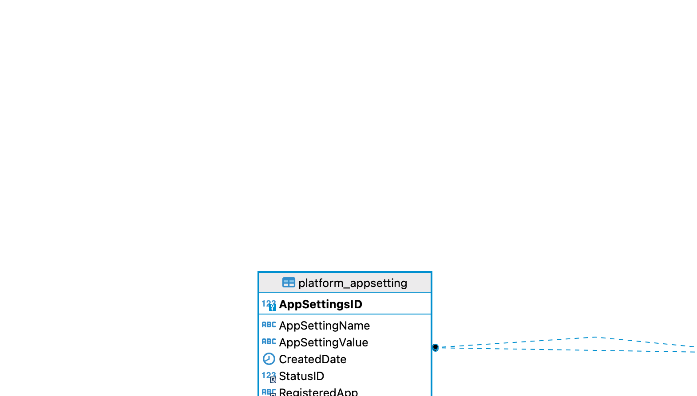
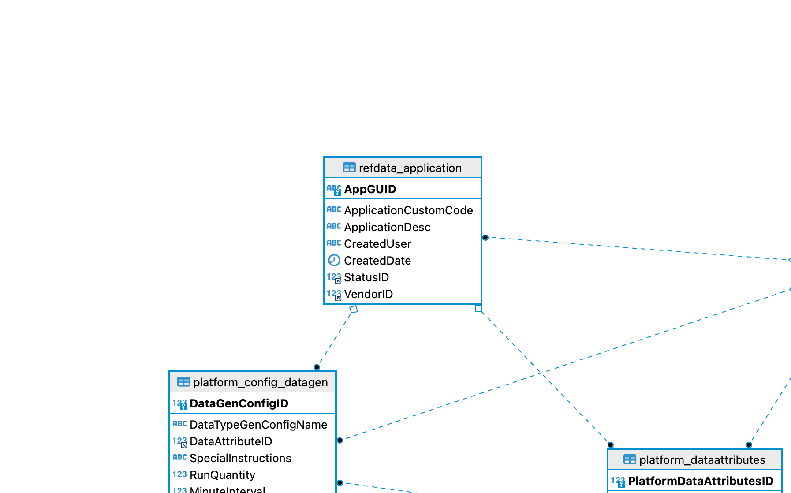
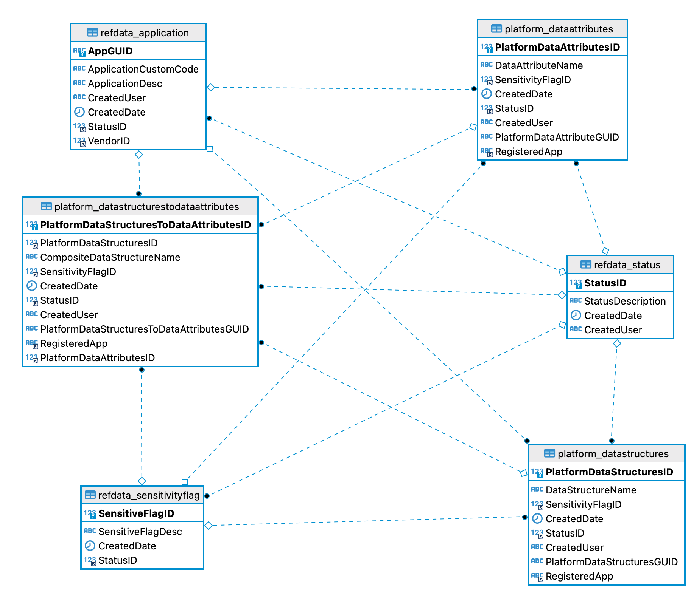
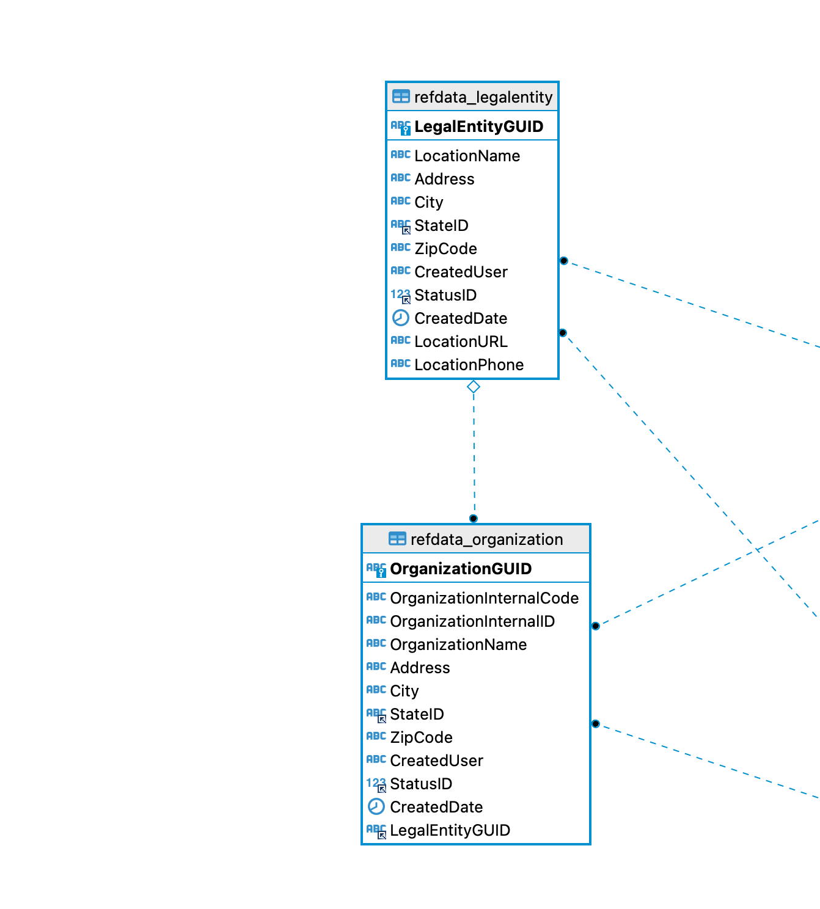
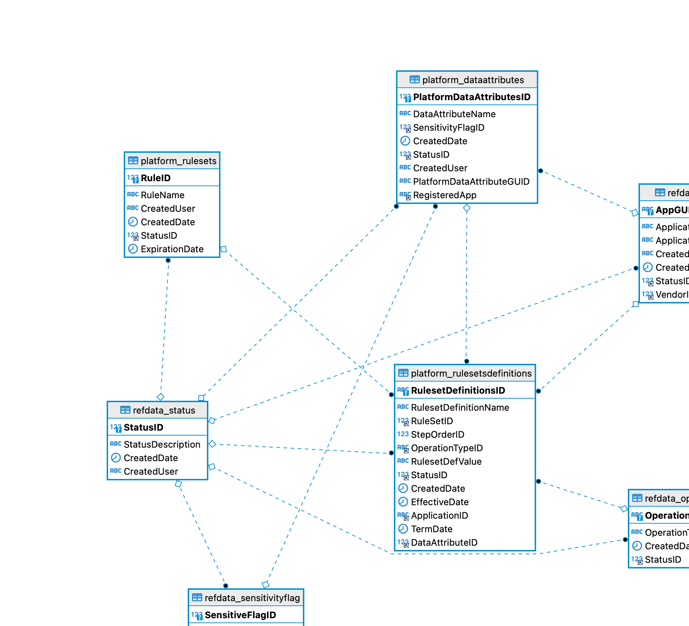
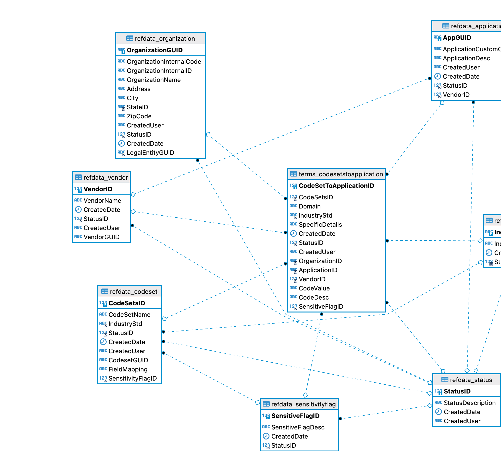

# DataSynthesis DataModel
The following content is designed to specifically break up the datamodel
into a few key areas.

# DataSythesis Artifacts
It is also important to note we have included several usable artifacts that  
help provide a detailed understanding of the Datasynthesis Data Model.

1. CSV file for tooling like LucidChart and it can be found in the MySQL\LucidChart-Import
directory.

# DataSynthesis DataModel Explained
The power of this platform is enabling the massive amount of ways data can be used and stored
within the model. As part of that we want to ensure we try and provide as much detail as we
can, we have several visuals we are providing to get everyone started.

## Application Settings
Application Settings are the way certain data and operations are tagged in the system
so having these established and setup is key. Additionally, as new capabilities are added application
settings are viewed by the platform as "tags".

## Data Generation
Data generators is a critical key aspect of the platform that will continue to be leveraged and expanded.
Data generation for the platform is intended to leverage code assets to build data artifacts based on
how the platform is configured.

## Data Structures
This is all about Building out what complete data the platform can represent.

## Organizations
Who is using the data and where they are located.

## Rulesets
Specific rules we want the platform to be able to process and maintain.

## Terms
Specific coded data and how we can enable it to be processed to enable more accurate and robust data processing.

